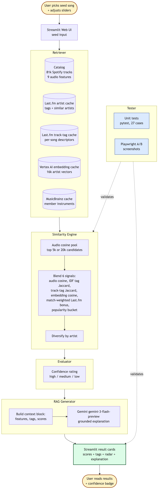

# 🎵 Music Discovery Engine

A Streamlit web app that finds similar music across genre boundaries. You pick a seed track, and the system returns a ranked list of similar tracks using a blend of audio features, community tags, and semantic embeddings, each with a confidence rating and a short Gemini-generated explanation.

The point is to push past the "you liked Beyoncé, here is more Beyoncé" failure mode that plagues most public recommenders. Real streaming services personalise from your listening history. We do not have that, so we lean on content-based signals (numeric audio features and human-written tags) and use them to surface tracks that share something specific with your seed even when the artist or scene is completely different.

---

## Original Project (Modules 1-3)

The earlier project was **VibeFinder 1.0**, a command-line recommender that scored a tiny handcrafted catalog of 18 songs against a user-supplied genre / mood / energy profile and printed a ranked table. Its goal was to demonstrate the basic content-based filtering pipeline (weighted feature vectors, cosine distance, top-k ranking) on a small enough scale that every step was inspectable. It did not have an LLM, a web UI, or any external data source.

This project, **Music Discovery Engine 2.0**, keeps that pipeline as the backbone. It scales the catalog to ~81k Spotify tracks, swaps the user-profile input for a seed-track input, blends in four new external signals (Last.fm artist tags, Last.fm track tags, Last.fm similar artists, Vertex AI embeddings), and adds a web UI plus LLM-generated explanations.

---

## Architecture Overview

The system has five named components, in request order:

1. **Retriever** pulls cached data: the Spotify catalog, Last.fm artist tags, Last.fm track tags, Vertex AI embeddings, and MusicBrainz instruments.
2. **Similarity Engine** blends six signals into a score for each candidate (audio cosine, IDF-weighted tag Jaccard, track-tag Jaccard, embedding cosine, match-weighted Last.fm bonus, popularity bucket).
3. **Evaluator** rates each result high / medium / low based on how many independent signals agree.
4. **RAG Generator** builds a context block from the retrieved data and asks Gemini to ground a 2-3 sentence explanation in it.
5. **Tester** sits alongside the pipeline rather than in it. Validates engine logic via 27 pytest cases and verifies UI behavior via Playwright A/B screenshots.



**How to read it.** The user enters a seed at the top. The request flows down through Retriever → Similarity Engine → Evaluator → RAG Generator, lands as a rendered result card, and the user reads it at the bottom. Solid arrows are the request path; dotted arrows are the testing checks that sit alongside the pipeline. The Tester block (right side) runs offline (unit tests + Playwright A/B captures), and the Confidence rating runs inline on every result and shows up as a badge in the UI so the user can judge how much to trust each pick.

Diagram files: [system_diagram.png](assets/system_diagram.png) (rendered image, shown above), [system_diagram.mmd](system_diagram.mmd) (Mermaid source), [system_diagram.md](system_diagram.md) (plain-text fallback for environments that do not render images), [flowchart.mmd](flowchart.mmd) (per-query step-by-step view).

---

## How This Extends the Baseline CLI

The original VibeFinder CLI ranked songs by audio cosine plus a single-genre tag match and printed a table. This Streamlit app keeps that recommender as the backbone and adds several capabilities on top.

### Retrieval-Augmented Generation (RAG)

For the top results, the app retrieves the seed and candidate audio features, the shared community tags, the audio and tag scores, and the confidence rating. It packages those into a structured context block and sends it to Gemini, which returns a 2-3 sentence explanation focused on actual musical qualities. The prompt instructs the model to reference the retrieved data rather than answer from training, so the explanation is grounded in this catalog rather than the model's general knowledge. Code lives in `src/rag.py`.

### Reliability and testing system

Three layers measure how well the system performs:

- **Unit tests.** 27 tests in `tests/` cover the audio cosine, IDF-weighted tag Jaccard, blended scoring, confidence rating, data loading, and catalog search. `pytest` runs in under a second.
- **Confidence ratings.** Every result is labelled high, medium, or low based on how many independent signals agree (audio cosine, tag overlap, Last.fm corroboration, score margin to the next result). See `compute_confidence` in `src/similarity.py`.
- **End-to-end A/B captures.** `scripts/screenshot_app.py` drives Playwright against the running app and saves before-and-after PNGs whenever engine behavior changes. Useful for verifying that engine changes actually land in the UI, not just in the unit tests. Captures are committed to `assets/` for diffing against future runs.

### Multi-signal similarity engine

The CLI used audio cosine plus a single-genre tag match. This app blends six layered signals into the score:

- Cosine similarity on 9 weighted Spotify audio features.
- IDF-weighted Jaccard on Last.fm artist tags, so rare tags ("shoegaze") carry more weight than common ones ("rock").
- Match-weighted Last.fm similar-artist bonus that scales with the actual 0-1 confidence score, replacing the old flat bonus.
- Track-level Last.fm tags when both seed and candidate have them, with graceful fallback to artist-level tags otherwise.
- Vertex AI text-embedding cosine in 768-dim space, capturing semantic relationships that Jaccard cannot.
- Popularity-bucket modifier so mainstream seeds stay in mainstream space and obscure seeds in obscure space.

### Specialised models from Vertex AI

Two purpose-built models, picked off the shelf rather than fine-tuned by us:

- `text-embedding-005` for the per-artist semantic vectors. Embeddings are L2-normalised at save time so cosine becomes a single dot product at query time.
- `gemini-3-flash-preview` for the RAG explanations. Specialised for low-latency text generation.

### Track-level (song-first) matching

The CLI matched on artist-level signals, so seeding Stairway versus Black Dog produced the same neighborhood. This app fetches per-song Last.fm tags and uses them in preference to artist tags whenever both seed and candidate have them. Track tags carry song-specific descriptors ("ballad", "guitar riff", "indie folk") that artist tags miss. Coverage is partial because Last.fm community tagging is sparse outside contemporary pop and hip-hop, so the system falls back to artist tags when song-level data is missing.

### Discovery mode

A sidebar toggle that flips the scoring to surface non-canonical neighbors. Candidates with embedding cosine in the [0.45, 0.65] sweet spot get a bonus (close enough to feel related, far enough to feel novel), strong-canon embeddings above 0.75 get a penalty, and less-popular candidates get a small obscurity bonus. Useful for finding tracks that share a sonic dimension with the seed but live outside its scene.

### Web UI

Streamlit interface in place of console output. Searchable seed selection, per-feature audio-weight sliders, similarity-blend control, mode toggle, expandable result cards with radar charts, shared tags, and the RAG explanation surfaced inline.

---

## Setup Instructions

### 1. Install

```bash
python -m venv .venv
source .venv/bin/activate        # Mac or Linux
pip install -r requirements.txt
playwright install chromium      # only needed if you want to run scripts/screenshot_app.py
```

### 2. API keys

Copy `.env.example` to `.env` and fill in whichever keys you have:

- **`LASTFM_API_KEY`**: free, takes about 30 seconds to register at https://www.last.fm/api/account/create. Required for the tag layer and Last.fm confirmations. Without it the app still runs on audio features alone.
- **`GOOGLE_API_KEY`**: free tier at https://aistudio.google.com/apikey. Required for both the RAG explanations and the Vertex AI embedding enrichment. Without it results render without explanation text and the embedding signal is unavailable.

### 3. Build the catalog

```bash
python -m scripts.prepare_catalog
```

Reads `data/spotify-tracks.csv`, cleans and deduplicates, writes `data/catalog.csv`.

### 4. Enrich Last.fm artist data

```bash
python -m scripts.enrich_with_lastfm_v2
```

Fetches artist tags and similar-artist lists from Last.fm at 5 requests per second. The v2 script orders the queue by track count in the catalog, so high-impact artists (the ones who appear on the most tracks) get fetched first. Resumable. Stop with Ctrl-C any time and re-run later.

### 5. Enrich Last.fm track tags

```bash
python -m scripts.enrich_with_track_tags --limit 10000
```

Fetches per-song Last.fm tags, ordered by popularity. This is the song-first signal that lets the engine differentiate one track by an artist from another track by the same artist. Last.fm has a real coverage ceiling here (~16% of attempts return usable tags), so this works best for popular contemporary tracks.

### 6. Build Vertex AI artist embeddings

```bash
python -m scripts.enrich_with_embeddings
```

Embeds each cached artist's text doc (tags + similar artists) into a 768-dim vector via Vertex AI `text-embedding-005`. About 5 minutes for ~16k artists, batched 100 at a time. Resumable.

### 7. Run the app

```bash
streamlit run app.py
```

Then search for an artist or song, pick a seed, and adjust the sliders. Try toggling Discovery mode in the sidebar to see non-canonical recommendations.

### Running tests

```bash
pytest
```

Covers data loading, normalization, catalog search, cosine similarity, IDF-weighted tag similarity, blended scoring, and confidence rating.

---

## Sample Interactions

Three seeds chosen to show the system across different coverage regimes.

### Example 1: Kendrick Lamar "HUMBLE." (modern hip-hop, high coverage)

**Seed:** HUMBLE. by Kendrick Lamar

**Top results:**

| # | Score | Artist - Track | Tag layer | Shared tags |
|---|-------|----------------|-----------|-------------|
| 1 | 0.815 | Tinashe;ScHoolboy Q - 2 On | track | hip-hop, pop rap, rap |
| 2 | 0.793 | Travis Scott - BUTTERFLY EFFECT | track | 2010s, 2017, hip-hop, rap |
| 3 | 0.777 | Travis Scott - goosebumps | track | hip-hop, pop rap, rap, trap |
| 4 | 0.768 | BLACKPINK - Shut Down | track | hip-hop, pop, pop rap, rap |
| 5 | 0.766 | XXXTENTACION - Look At Me! | track | hip-hop, rap, trap |

**Why this case is interesting.** 8 of 10 results matched on track-level tags, not artist-level tags. The shared tags are song-level descriptors (*pop rap*, *trap*) rather than just artist-level genre labels. This is the regime where the song-first design is doing its real work. Confidence ratings ran medium-to-high across the top.

Screenshot: [assets/ui_tracktags_humble.png](assets/ui_tracktags_humble.png)

### Example 2: Taylor Swift "august" (cross-artist song-first match)

**Seed:** august by Taylor Swift

**Top result:** Vance Joy - Riptide

**Shared track tags:** *folk*, *indie folk*, *indie pop*, *singer-songwriter*

**Why this case is interesting.** Taylor Swift's artist-level tags are dominated by *pop* and *country pop*. If the engine matched on artist tags alone, you would get more country-pop tracks. Because both *august* and *Riptide* have track-level tags including *indie folk*, the engine surfaces Vance Joy as the #1 match even though Vance Joy is not in Taylor Swift's Last.fm similar-artist list. This is the cross-artist song-first match the song-level signal was added to enable.

Screenshot: [assets/ui_tracktags_august.png](assets/ui_tracktags_august.png)

### Example 3: Black Dog (Led Zeppelin), default vs discovery mode

**Seed:** Black Dog - Remaster by Led Zeppelin

**Default mode top 5:** The Doors "Touch Me", The Rolling Stones "Dead Flowers", The Rolling Stones "Brown Sugar", The Doors "Love Me Two Times", Rainbow "Since You Been Gone".

The default-mode list is the classic-rock canon. All 10 results share Last.fm tags like *blues rock*, *classic rock*, *british*, *hard rock*. This is what you would expect from a system whose Last.fm-derived signals all encode the seed band's neighborhood.

**Discovery mode top 5:** The Raspberries "Go All The Way", Matt Costa "Short Change Hero", Mike & The Mechanics "Over My Shoulder", and two more rock-adjacent picks outside the canon.

The discovery list is rock-adjacent but explicitly outside the Zeppelin canon. None of these would have appeared in default mode. The mode flips the embedding signal from a bonus to a penalty for canon candidates and rewards mid-band embedding cosine [0.45, 0.65], which is the "close enough to feel related, far enough to feel novel" sweet spot.

Screenshots: [default](assets/ui_default_zeppelin.png), [discovery](assets/ui_discovery_zeppelin.png).

---

## Design Decisions and Trade-offs

A handful of decisions were not obvious at the time and shaped how the system behaves.

**Used Vertex AI `text-embedding-005` (768 dim) instead of `gemini-embedding-001` (3072 dim).** The smaller model keeps the on-disk cache around 9 MB for 16k artists and makes cosine a single fast dot product. The trade-off is less semantic resolution. For our use (artist-level docs that are short tag-and-similar-artist strings) the smaller model has produced sensible neighborhoods, so the 4x compute and storage savings were worth it.

**Track-tag layer falls back to artist tags rather than skipping candidates without track tags.** Last.fm track-tag coverage is sparse (~16% hit rate even for popular tracks), so requiring track tags would silently exclude most candidates. Falling back to artist tags keeps the result set populated; the trade-off is that song-first matching only fires when both seed and candidate have track tags. The result dict surfaces a `tag_layer` field ("track" / "artist" / None) so the UI can show which signal drove each pick.

**Discovery mode targets a mid-band embedding cosine [0.45, 0.65] rather than just minimising cosine.** A naive "anti-canon" filter that pushes toward minimum embedding cosine surfaces total non-sequiturs (a Cuban son track that happens to share Black Dog's audio shape). The mid-band sweet spot keeps results recognisably in the seed's broader neighborhood while excluding the obvious canon. The trade-off is that the bounds are heuristic and depend on how the embedding model distributes distances; they would need retuning if we switched embedding models.

**Did not add Spotify API enrichment.** The natural source for richer per-track audio analysis (segments, sections, timbre vectors) and reliable release-date data is Spotify's `audio-analysis` and `tracks` endpoints. We chose not to add a Spotify dependency for this version, so the system relies on the 9 Spotify-derived audio features already in the Kaggle catalog plus Last.fm and Vertex AI for everything else. The trade-off is weaker per-song discrimination on the audio side and no era penalty.

**Did not fine-tune any models.** Two purpose-built specialist Vertex AI models are used as-is (`text-embedding-005` for embeddings, `gemini-3-flash-preview` for RAG explanations). Fine-tuning either would require a labelled dataset of similarity judgments that we do not have. The trade-off is that the embedding space encodes general semantic relationships rather than music-domain ones, which limits its discrimination power on close-genre comparisons (eg. "is this candidate more shoegaze or more dream pop").

**Diversification cap of 2 results per artist.** Without it, the same artist often dominates the top-5. With it, the result set always shows multiple distinct artists, which is more useful for discovery. The trade-off is that the genuinely best second-best track from a single artist gets pushed off the list.

---

## Testing Summary

What worked, what did not, what I learned.

### What worked

- **Confidence ratings caught problems early.** When I first added the wider audio candidate pool, the confidence ratings of low-quality picks dropped visibly. The ratings exposed exactly the kind of weak audio-only matches I wanted to push out of the top results.
- **Playwright A/B captures verified that UI changes actually landed.** Several times I changed engine code and the unit tests passed but the Streamlit cache served stale output. The screenshot diffs caught that mismatch every time.
- **Unit tests caught subtle bugs.** Two real ones I would otherwise have missed: a `numpy.int64` index that broke `isinstance(..., int)` checks in `find_similar`, and a NaN artist value in the catalog that crashed the `.lower()` chain on a Mozart seed.
- **Resumable enrichment scripts.** Letting the long-running scripts checkpoint per artist and skip cached entries on restart paid off every time the network blipped or I had to interrupt to fix a bug.

### What did not work

- **MusicBrainz instrument fingerprint.** The signal only fires when both seed and candidate have structured member-instrument data, which is true for ~19% of cached artists. For the remaining ~81% the signal contributes nothing. After two iterations of trying to make it useful, I left it in but with negligible impact on the score. Useful learning: a signal at 19% coverage is effectively dead, regardless of how clever the algorithm is.
- **Last.fm track-tag enrichment hit a hard ceiling.** Even for the top 10k catalog tracks by popularity, only ~16% returned usable Last.fm track tags. Many of the responses came back successful but with empty tag arrays. The data is just not there for non-pop genres.
- **Audio cosine on 9 features is too coarse to do real song-level matching.** Two tracks with the same nine averaged values can be sonically completely different. The audio signal works for "find me other slow acoustic tracks" but not "find me tracks with the heavy electric guitar of Black Dog". This is a known limitation of feature-summary audio data; addressing it would require a richer audio analysis source we did not have.

### What I learned

- **Coverage matters more than algorithm.** Several of my best ideas (instrument fingerprints, track tags) ended up gated by data sparsity from the upstream source. The signal does not work below some coverage floor regardless of how thoughtful the math is.
- **Artist-level signals dominate when only the audio layer is per-song.** Until the track-tag layer was added, seeding Stairway versus Black Dog produced the same artist-level neighborhood and only the audio cosine differentiated them. The fix was getting more per-song data, not tweaking the artist-level algorithm.
- **Discovery and canonical matching are different problems.** The default scoring and the discovery scoring share an audio backbone but otherwise have nearly opposite signals. Treating them as one problem with a knob did not work; treating them as two modes with different scoring functions did.

---

## Reflection

The biggest thing I learned on this project is how much of a recommender's "intelligence" is really just two choices: what data you feed it, and which signal you weight most. The audio features on their own produced results that were mathematically correct and musically useless. The top neighbors of "Stairway to Heaven" with the tag layer turned off were a Josh Groban opera ballad, a Hins Cheung cantopop ballad, and a B Praak Indian film-pop track, all tied within a thousandth of a point. It took adding a Last.fm tag layer, which is just set overlap on human-written labels, for the system to start feeling like it understood anything. That reframed how I think about AI products in general. The parts that feel smart are often the parts leaning hardest on work someone else already did.

The other thing that stuck with me is how confident a generated explanation can sound even when it is standing on shaky ground. Gemini never hesitates. It writes fluently about connections between tracks whether those connections are strong or weak. The only defense against that in this system is showing the scores and the confidence level next to the prose, so the user has something concrete to check the explanation against. That feels like a pattern worth carrying into any future LLM-facing feature I build.

Late in the project a different framing emerged that changed how I think about the whole problem. The goal is not "find me music similar to the band that made this song". It is "find me music similar to this specific song". A band can have a slow ballad and a hard-rock track in the same catalog, and a user who liked the ballad does not want more hard rock. Most of the signals I had built were keyed on the artist, so seeding two very different songs by the same artist produced almost identical recommendations. Adding track-level tags helped, but only where the data was there. The deeper lesson is that the level of granularity in your inputs determines the granularity of your outputs, and any system whose signals are mostly per-artist will quietly collapse song-level distinctions even when the user is asking for them.

See [reflection.md](reflection.md) and [model_card.md](model_card.md) for fuller treatment.

---

## Responsible AI

A few questions worth answering directly: limits, misuse, surprises, and how I worked with AI on this project.

### What are the system's limitations or biases?

The biggest one is structural. The catalog comes from the Kaggle Spotify Tracks Dataset, which over-represents popular Western artists. Last.fm community tagging has the same skew, and the track-tag layer adds a second skew on top because contemporary pop and hip-hop get tagged densely while classic rock, jazz, and most non-English music do not. The result is that two of the three layers we use to judge "is this a real match" are noisier the further the seed gets from the popular-Western mainstream. A K-pop seed and a Bollywood seed return reasonable neighbors. An Argentine tango seed gets fewer real matches, lower confidence, and more audio-only fallback noise.

A second, less obvious bias is in the explanation layer. Gemini will write a confident-sounding paragraph about any two tracks I hand it, given the features and shared tags. The explanation prose is fluent regardless of how strong the underlying signals actually are. The confidence badge helps a user weigh that, but a casual reader could easily read the explanation as ground truth.

### Could the system be misused?

A music recommender at scale shapes what people hear as "similar". The choices baked into this system (which signals get weighted, what the popularity bucket does, what the canon penalty looks like) are policy decisions, not technical ones. A bad-faith operator could weight the system to push specific artists, exclude certain genres, or homogenize listening into a narrow band. A naive operator could let it run with the default popularity bias and quietly under-surface long-tail artists for everyone.

The defenses I put in place are deliberately limited but real. Every result shows its scores, its shared tags, and its confidence rating, so the user can see what is driving the recommendation rather than trusting a black box. The discovery-mode toggle gives the user a way to step outside the canon when the canonical recommendations feel like an echo chamber. There is no engagement-based feedback loop (no "users who clicked this also clicked that"), so the system cannot build self-reinforcing filter bubbles from prior usage. Real-world deployment would need at minimum an audit of which artists get under-recommended at default settings, plus a way for users to flag bad recommendations.

### What surprised me while testing reliability?

Two things. First, how much "AI quality" turned out to be coverage quality. The MusicBrainz instrument-fingerprint signal looked rich on paper. In practice it was 19% coverage, mostly silent. The Last.fm track-tag layer hit a 16% wall on popular tracks. After both of those, the lesson sank in: the algorithm did not matter once the data dropped below roughly 40%. The thing I had been building was a machine for combining signals that often were not there.

Second, how confident the LLM stayed even when the recommendation was weak. Gemini does not hedge based on the confidence rating I send it. The prose is just as smooth on a low-confidence pick as on a high-confidence one. That made the confidence badge feel essential, not optional, because the prose itself does not carry the uncertainty.

### Collaboration with AI

I built this system in a paired session with Claude. Most of the engineering decisions were proposed by the AI and either accepted, rejected, or modified by me. Two examples stand out.

**A useful suggestion.** When I articulated the song-first goal (a band's slow ballad and hard-rock track should produce different recommendations), Claude proposed track-level Last.fm tags as the concrete fix and built the wiring before the data finished landing. The first real validation was Taylor Swift's "august" surfacing Vance Joy's "Riptide" via shared *indie folk / indie pop*, which is exactly the cross-artist song-first match the prior architecture missed. The reframing came from me; the implementation path came from Claude.

**A flawed suggestion.** Earlier in the project, Claude proposed adding a MusicBrainz instrument fingerprint as a similarity signal. The pitch was that band-composition similarity (rock band with guitar / drums / bass vs jazz quartet with piano / sax) would catch cross-genre coincidences the audio cosine missed. I went along with it. After the cache landed, we measured 19% coverage and confirmed the signal was effectively dead for ~80% of artists. The first attempt at discovery mode had a similar shape: the initial implementation surfaced children's-pop covers and EDM remixes for a Black Dog seed because the canon penalty was too aggressive, and we needed several correction passes before it produced anything useful. The general lesson is that AI suggestions are good at finding clever-looking signals but tend to underweight the question of whether the signal will fire often enough to matter.

---

## Limitations and Risks

- **Audio features only capture production signatures, not meaning.** Two tracks with near-identical feature vectors can be totally different in lyrical content, language, or cultural context. The tag layer helps, but it is still surface-level.
- **Last.fm tag quality varies.** Popular Western artists have rich, consensus tags. Long-tail or non-Western artists often have sparse or idiosyncratic tags. Tag similarity is noisier for those.
- **Catalog skew.** The Kaggle dataset over-represents popular Western genres. If a user's seed is from an under-represented region or style, the neighbors will pull toward the majority even when better matches theoretically exist.
- **No personalization or feedback loop.** Every user starts from the same cold state. The system has no notion of "tracks I've already heard" or "tracks I disliked".
- **Explanations are generated text, not ground truth.** Gemini reasons over the context block we give it. If the feature values disagree with genre reality (a misclassified track, say), the explanation will confidently describe a connection that does not really exist.

See [model_card.md](model_card.md) for a fuller treatment.

---

## Project Layout

```
app.py                              Streamlit entry point
src/
  config.py                         Paths, feature names, defaults, .env loading
  data_loader.py                    Catalog load + search + normalization
  similarity.py                     Cosine + IDF Jaccard + blended scoring + confidence + discovery mode
  lastfm_client.py                  Rate-limited Last.fm API client with JSON cache
  musicbrainz_client.py             Rate-limited MusicBrainz client
  embeddings.py                     Vertex AI embedding client + cache I/O
  enrichment.py                     Cache loaders + IDF computation
  rag.py                            Gemini prompt construction + API call
scripts/
  prepare_catalog.py                Clean the Kaggle CSV into catalog.csv
  enrich_with_lastfm.py             Original Last.fm enrichment (alphabetic order)
  enrich_with_lastfm_v2.py          Priority-ordered Last.fm enrichment (preferred)
  enrich_with_track_tags.py         Per-song Last.fm tag enrichment
  enrich_with_embeddings.py         Vertex AI text-embedding enrichment
  screenshot_app.py                 Playwright A/B screenshots
tests/                              Pytest suite (27 cases)
data/
  spotify-tracks.csv                Raw Kaggle dataset (input)
  catalog.csv                       Cleaned catalog (output of prepare_catalog)
  lastfm_cache/                     Per-artist + per-track Last.fm JSON cache
  musicbrainz_cache/                MusicBrainz artist instrument cache
  embeddings/artist_embeddings.npz  Vertex AI embeddings (matrix + names)
assets/                             System diagram + committed UI captures (rubric: dedicated /assets folder)
```
