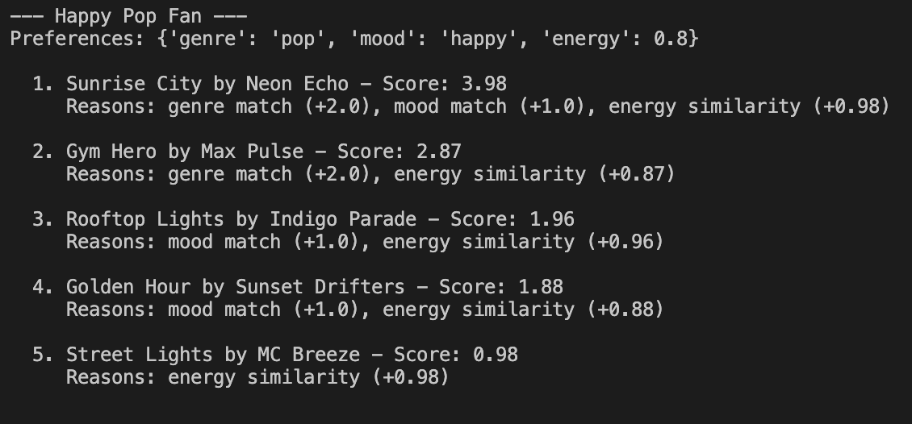
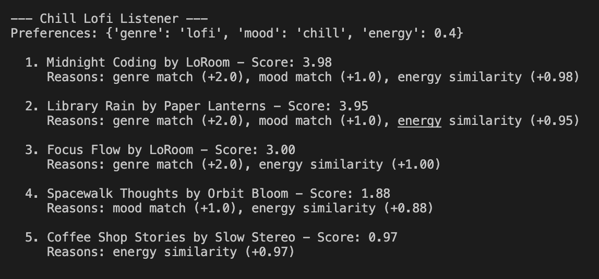
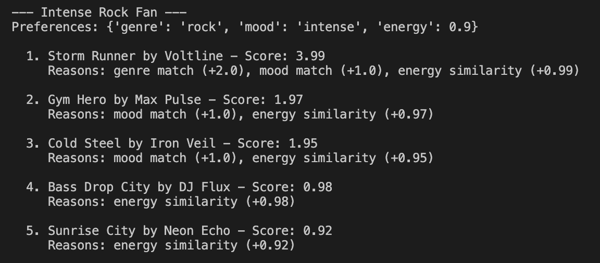
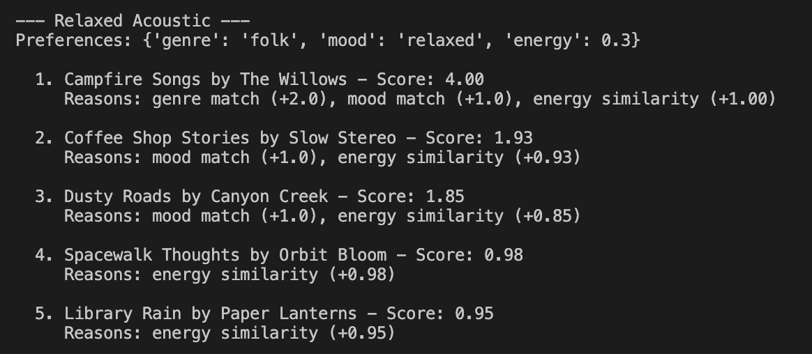

# 🎵 Music Recommender Simulation

## Project Summary

In this project you will build and explain a small music recommender system.

Your goal is to:

- Represent songs and a user "taste profile" as data
- Design a scoring rule that turns that data into recommendations
- Evaluate what your system gets right and wrong
- Reflect on how this mirrors real world AI recommenders

This is a simple music recommender that takes a user's preferences (like genre, mood, and energy level) and scores songs from a CSV catalog to find the best matches. It uses content-based filtering, meaning it looks at the attributes of each song rather than tracking what other users listened to. The output is a ranked list of recommendations with explanations for why each song was picked.

---

## How The System Works

Real streaming platforms like Spotify use two main approaches to recommend music. Collaborative filtering looks at what similar users listened to and assumes you might like the same things. Content-based filtering looks at the actual attributes of songs (genre, energy, mood, etc.) and tries to match them to your preferences. Our system uses content-based filtering since we don't have real user data to work with.

### Song Features

Each song in the catalog has these attributes:
- **genre** -- the style of the song (pop, lofi, rock, etc.)
- **mood** -- the general feeling (happy, chill, intense, etc.)
- **energy** -- how intense the song feels (0.0 to 1.0)
- **tempo_bpm** -- beats per minute
- **valence** -- how positive the song sounds (0.0 to 1.0)
- **danceability** -- how easy it is to dance to (0.0 to 1.0)
- **acousticness** -- how acoustic vs electronic it sounds (0.0 to 1.0)

### User Profile

The `UserProfile` stores a user's taste preferences:
- **favorite_genre** -- the genre they prefer
- **favorite_mood** -- the mood they gravitate toward
- **target_energy** -- their ideal energy level (0.0 to 1.0)
- **likes_acoustic** -- whether they prefer acoustic-sounding music

### Algorithm Recipe

The scoring logic works like this:
- **+2.0 points** for a genre match
- **+1.0 point** for a mood match
- **Up to +1.0 points** for energy similarity (the closer the song's energy is to the user's target, the more points)

After every song gets a score, we sort them highest to lowest and return the top results.

### Data Flow

See [flowchart.mmd](flowchart.mmd) for a Mermaid diagram of how the system processes a recommendation.

### Expected Biases

This system will probably lean too heavily on genre since it is worth the most points. A song that matches genre but has the wrong mood and energy could still beat a song that nails everything except genre. The catalog is also pretty small, so some genres only have one or two songs to choose from.

---

## Getting Started

### Setup

1. Create a virtual environment (optional but recommended):

   ```bash
   python -m venv .venv
   source .venv/bin/activate      # Mac or Linux
   .venv\Scripts\activate         # Windows

2. Install dependencies

```bash
pip install -r requirements.txt
```

3. Prepare the catalog:

```bash
python -m scripts.prepare_catalog
```

4. Run the app:

```bash
streamlit run app.py
```

### Running Tests

Run tests with:

```bash
pytest
```

---

## Experiments You Tried

I tested the system with four different user profiles: Happy Pop Fan, Chill Lofi Listener, Intense Rock Fan, and Relaxed Acoustic. Each one returned results that mostly made sense. The pop fan got Sunrise City at the top, the lofi listener got Midnight Coding, the rock fan got Storm Runner, and the acoustic listener got Campfire Songs.









I then ran an experiment where I halved the genre weight (from 2.0 to 1.0) and doubled the energy weight (from 1.0 to 2.0). The biggest change was in the Happy Pop Fan results. With the original weights, Gym Hero (pop, intense) ranked #2 because it matched on genre. After the shift, Rooftop Lights (indie pop, happy) jumped above it because its mood and energy were a better fit, even though its genre was not an exact match. That result actually felt more accurate to me, since someone who wants "happy pop" probably cares more about the vibe than the exact genre label.

The other profiles did not change as much. The top result stayed the same across all of them.

---

## Limitations and Risks

- The catalog only has 18 songs, so some genres (like rock or classical) only have one song. That means the system cannot really give variety for those users.
- Genre matching is worth the most points, which can push songs with the wrong mood or energy above songs that actually fit the vibe better.
- The system does not consider lyrics, language, or anything about the actual sound of the music. Two songs labeled "happy" could sound completely different.
- It treats every user the same way. Someone who cares mostly about mood has no way to tell the system that genre does not matter to them.

More details in the [model card](model_card.md).

---

## Reflection

[**Model Card**](model_card.md)

Building this recommender showed me that recommendations are really just math on top of labels. The system does not actually listen to music or understand what sounds good together. It just checks whether the genre and mood strings match and how close the energy numbers are. That is enough to produce results that feel reasonable most of the time, but it also means the system is only as good as the data and the weights you give it.

The bias part was interesting. Just by making genre worth more points than mood, the system started recommending intense songs to people who wanted something happy, as long as the genre was right. In a real product, that kind of thing could push users into a narrow bubble where they only hear one type of music because the algorithm keeps rewarding the same label over and over. It made me think about how much power these weight decisions have, even in a system this small.

---

## Optional Extensions

### Challenge 1: Advanced Song Features

Added five new attributes to every song in the catalog: popularity (0-100), release_decade, mood_tag (specific tags like "euphoric", "nostalgic", "aggressive"), instrumentalness (0.0-1.0), and loudness (0.0-1.0). Each one has its own scoring rule. Mood tag match gives +0.75, decade match gives +0.5, and instrumentalness/loudness each give up to +0.5 based on how close the song is to the user's target. The new features give the system more to work with when differentiating songs that would have tied before. For example, Rooftop Lights now scores higher than Gym Hero for the Happy Pop Fan because its mood tag and loudness are a better fit.

### Challenge 2: Multiple Scoring Modes

Added four scoring modes that change how much each factor is worth: balanced (the default), genre-first, mood-first, and energy-focused. You can switch between them from the CLI menu by pressing "m". Genre-first cranks genre up to 4.0 and lowers everything else, mood-first makes mood worth 3.0, and energy-focused makes energy worth up to 3.0. This lets you see how the same profile gets different results depending on which factor the system cares about most. It also makes the earlier weight experiment from Phase 4 something you can try on the fly without editing code.

### Challenge 3: Diversity Penalty

Added a diversity toggle (press "d" in the CLI) that penalizes songs if the same artist or genre keeps showing up in the results. If an artist already appeared in the picks, the next song by them gets -1.5 points. If the same genre has already been picked twice, any additional songs from that genre get -0.5. The system builds the list one song at a time, re-evaluating penalties at each step so the best adjusted score always wins. This helps prevent cases where, for example, all five recommendations are lofi tracks just because the user likes chill music.

### Challenge 4: Visual Summary Table

Replaced the plain text output with a formatted ASCII table that shows rank, title, artist, score, and reasons in aligned columns. The column widths adjust automatically based on the data so everything lines up regardless of how long the song titles or reason strings are. No external libraries needed.

