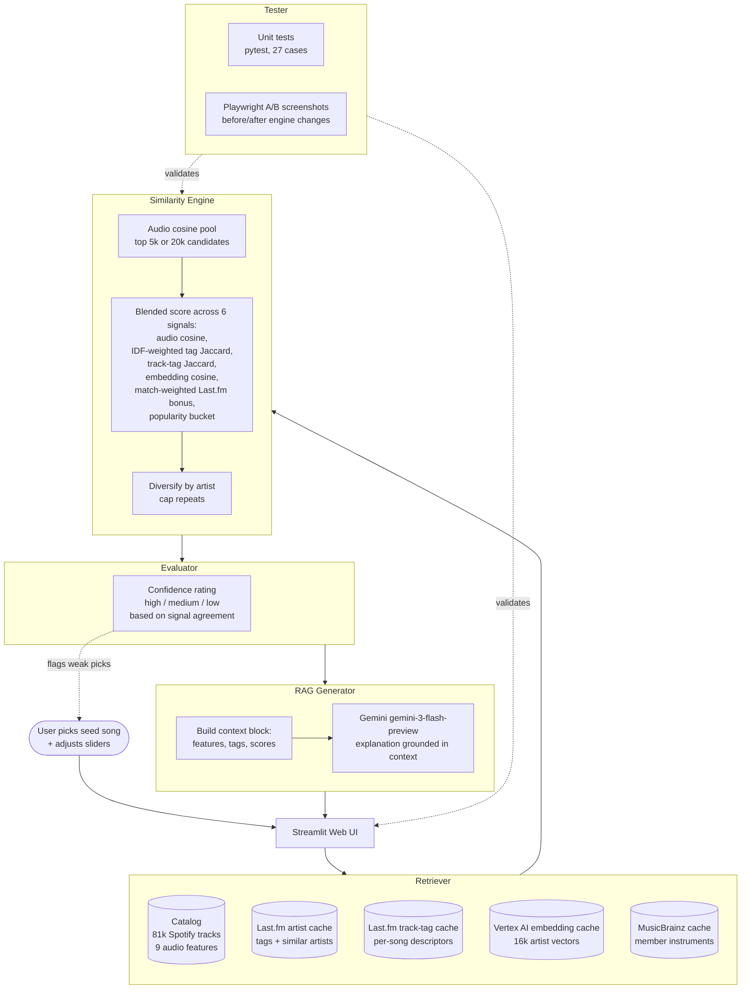

# 🎵 Music Discovery Engine

A Streamlit web app that finds similar music across genre boundaries. You pick a seed track, and the system returns a ranked list of similar tracks using three signals: cosine similarity on audio features, Jaccard similarity on Last.fm community tags, and a small bonus when Last.fm's "similar artists" list agrees. Google Gemini generates a short natural-language explanation for the top results.

---

## How The System Works

Real streaming platforms combine collaborative filtering (what similar users listened to) with content-based filtering (attributes of the songs themselves). This project is content-based only, since we have no user listening data. The novelty is blending a numeric audio-feature layer with a textual community-tag layer so that two tracks can be judged both by *how they sound* and by *how listeners describe them*.

### Data

- **Catalog:** `data/catalog.csv`, derived from the Kaggle Spotify Tracks Dataset (~81k tracks, ~31k artists, 114 genres). Each row has 9 audio features: danceability, energy, loudness, speechiness, acousticness, instrumentalness, liveness, valence, tempo. Loudness and tempo are min-max normalized to `[0, 1]` during catalog preparation; the rest arrive already in range.
- **Last.fm cache:** `data/lastfm_cache/` holds one JSON file per artist per endpoint (`artist_tags_*.json`, `similar_artists_*.json`). Populated on demand by `scripts/enrich_with_lastfm.py`.

### Scoring

For each candidate track in the catalog:

1. **Audio similarity**: cosine similarity between the seed's weighted audio vector and the candidate's. Feature weights are adjustable from the sidebar (default 1.0 each).
2. **Tag similarity**: Jaccard index between the seed artist's Last.fm tags and the candidate artist's tags.
3. **Last.fm bonus**: +0.05 when Last.fm's `artist.getSimilar` for the seed artist lists the candidate artist.
4. **Blended score**: `audio_score * audio_weight + tag_score * tag_weight + lastfm_bonus`, clamped to `[0, 1]`. Default blend is 70% audio / 30% tag.
5. **Confidence**: `high` / `medium` / `low` based on how many signals agree (strong audio score, strong tag overlap, Last.fm confirmation, and margin over the next result).

If the Last.fm cache is empty, the app falls back to audio-only scoring and surfaces a sidebar notice.

### Explanations

For the top 5 results, the app builds a short context block (seed + candidate features, shared tags, scores) and sends it to Gemini, which returns a 2-3 sentence explanation focused on musical qualities rather than genre labels. Explanations are optional. If no `GOOGLE_API_KEY` is set, results render without them.

### Data Flow

- [flowchart.mmd](flowchart.mmd): per-query step-by-step Mermaid diagram.
- [system_diagram.mmd](system_diagram.mmd): component-level Mermaid diagram (also embedded below).
- [system_diagram.md](system_diagram.md): plain-text version of the component diagram for environments that do not render Mermaid.

---

## System Diagram

The system has five named components: a **Retriever** that pulls cached data, a **Similarity Engine** that blends six signals into a score, an **Evaluator** that rates each result, a **RAG Generator** that grounds an explanation in the retrieved context, and a **Tester** that catches regressions before they reach the user.



**How to read it.** The user enters a seed at the top, the request flows through Retriever → Engine → Evaluator → Generator, and the rendered result lands back at the UI. Solid arrows are the request path; dotted arrows are the testing and confidence checks that sit alongside the pipeline rather than in it. The Tester subgraph runs offline (unit tests + Playwright captures), and the Confidence rating runs inline on every result and shows up as a badge in the UI so the user can judge how much to trust each pick.

---

## How This Extends the Baseline CLI

The original assignment was a command-line recommender that ranked songs by audio cosine plus a single-genre tag match and printed a table. This Streamlit app keeps that recommender as the backbone and adds several capabilities on top.

### Retrieval-Augmented Generation (RAG)

For the top results, the app retrieves the seed and candidate audio features, the shared community tags, the audio and tag scores, and the confidence rating. It packages those into a structured context block and sends it to Gemini, which returns a 2-3 sentence explanation focused on actual musical qualities. The prompt instructs the model to reference the retrieved data rather than answer from training, so the explanation is grounded in this catalog rather than the model's general knowledge. Code lives in `src/rag.py`.

### Reliability and testing system

Three layers measure how well the system performs:

- **Unit tests.** 27 tests in `tests/` cover the audio cosine, IDF-weighted tag Jaccard, blended scoring, confidence rating, data loading, and catalog search. `pytest` runs in under a second.
- **Confidence ratings.** Every result is labelled high, medium, or low based on how many independent signals agree (audio cosine, tag overlap, Last.fm corroboration, score margin to the next result). See `compute_confidence` in `src/similarity.py`.
- **End-to-end A/B captures.** `scripts/screenshot_app.py` drives Playwright against the running app and saves before-and-after PNGs whenever engine behavior changes. Useful for verifying that engine changes actually land in the UI rather than just in the unit tests. Captures are committed to `screenshots/` for diffing against future runs.

### Multi-signal similarity engine

The CLI used audio cosine plus a single-genre tag match. This app blends six layered signals into the score:

- Cosine similarity on 9 weighted Spotify audio features.
- IDF-weighted Jaccard on Last.fm artist tags, so rare tags ("shoegaze") carry more weight than common ones ("rock").
- Match-weighted Last.fm similar-artist bonus that scales with the actual 0-1 confidence score, replacing the old flat bonus.
- Track-level Last.fm tags when both seed and candidate have them, with graceful fallback to artist-level tags otherwise.
- Vertex AI text-embedding cosine in 768-dim space, capturing semantic relationships that Jaccard cannot.
- Popularity-bucket modifier so mainstream seeds stay in mainstream space and obscure seeds in obscure space.

### Specialised models from Vertex AI

Two purpose-built models, picked off the shelf rather than fine-tuned by us:

- `text-embedding-005` for the per-artist semantic vectors. Embeddings are L2-normalised at save time so cosine becomes a single dot product at query time.
- `gemini-3-flash-preview` for the RAG explanations. Specialised for low-latency text generation.

### Track-level (song-first) matching

The CLI matched on artist-level signals, so seeding Stairway versus Black Dog produced the same neighborhood. This app fetches per-song Last.fm tags and uses them in preference to artist tags whenever both seed and candidate have them. Track tags carry song-specific descriptors ("ballad", "guitar riff", "indie folk") that artist tags miss. Coverage is partial because Last.fm community tagging is sparse outside contemporary pop and hip-hop, so the system falls back to artist tags when song-level data is missing.

### Discovery mode

A sidebar toggle that flips the scoring to surface non-canonical neighbors. Candidates with embedding cosine in the [0.45, 0.65] sweet spot get a bonus (close enough to feel related, far enough to feel novel), strong-canon embeddings above 0.75 get a penalty, and less-popular candidates get a small obscurity bonus. Useful for finding tracks that share a sonic dimension with the seed but live outside its scene.

### Web UI

Streamlit interface in place of console output. Searchable seed selection, per-feature audio-weight sliders, similarity-blend control, mode toggle, expandable result cards with radar charts, shared tags, and the RAG explanation surfaced inline.

---

## Getting Started

### 1. Install

```bash
python -m venv .venv
source .venv/bin/activate        # Mac or Linux
pip install -r requirements.txt
```

### 2. API keys

Copy `.env.example` to `.env` and fill in whichever keys you have:

- **`LASTFM_API_KEY`**: free, takes about 30 seconds to register at https://www.last.fm/api/account/create. Required for the tag layer and Last.fm confirmations. Without it the app still runs on audio features alone.
- **`GOOGLE_API_KEY`**: free tier at https://aistudio.google.com/apikey. Required for Gemini explanations. Without it results render without explanation text.

### 3. Build the catalog

```bash
python -m scripts.prepare_catalog
```

Reads `data/spotify-tracks.csv`, cleans and deduplicates, writes `data/catalog.csv`.

### 4. (Recommended) Enrich with Last.fm

```bash
python -m scripts.enrich_with_lastfm --limit 500
```

Fetches artist tags and similar-artist lists from Last.fm at 1 request/second. The script is resumable, so cached artists are skipped on re-run. Start with `--limit 500` to cover the most-popular artists quickly; drop the flag to enrich the whole catalog (will take several hours).

Audio-only search works without this step, but recommendations across genre boundaries (e.g. Stairway to Heaven → other Western rock ballads rather than random slow tracks from any language) depend on having tag data.

### 5. Run the app

```bash
streamlit run app.py
```

Then search for an artist or song, pick a seed, and adjust the sliders to see how weighting changes the results.

### Running Tests

```bash
pytest
```

Covers data loading, normalization, catalog search, cosine similarity, Jaccard tag similarity, blended scoring, and confidence rating.

---

## Project Layout

```
app.py                       Streamlit entry point
src/
  config.py                  Paths, feature names, defaults, .env loading
  data_loader.py             Catalog load + search + normalization
  similarity.py              Cosine + Jaccard + blending + confidence
  lastfm_client.py           Rate-limited Last.fm API client with JSON cache
  enrichment.py              Load cached tags/similar artists into dicts
  rag.py                     Gemini prompt construction + API call
scripts/
  prepare_catalog.py         Clean the Kaggle CSV into catalog.csv
  enrich_with_lastfm.py      Batch-fetch Last.fm data
tests/                       Pytest suite for data_loader and similarity
data/
  spotify-tracks.csv         Raw Kaggle dataset (input)
  catalog.csv                Cleaned catalog (output of prepare_catalog)
  lastfm_cache/              Per-artist JSON cache from Last.fm
```

---

## Limitations and Risks

- **Audio features only capture production signatures, not meaning.** Two tracks with near-identical feature vectors can be totally different in lyrical content, language, or cultural context. The tag layer helps, but it's still surface-level.
- **Last.fm tag quality varies.** Popular Western artists have rich, consensus tags. Long-tail or non-Western artists often have sparse or idiosyncratic tags. Tag similarity will be noisier for those.
- **Catalog skew.** The Kaggle dataset over-represents popular Western genres. If a user's seed is from an under-represented region or style, the neighbors will pull toward the majority even when better matches theoretically exist.
- **No personalization or feedback loop.** Every user starts from the same cold state. The system has no notion of "tracks I've already heard" or "tracks I disliked."
- **Explanations are generated text, not ground truth.** Gemini reasons over the context block we give it. If the feature values disagree with genre reality (e.g., a misclassified track), the explanation will confidently describe a connection that doesn't really exist.

See [model_card.md](model_card.md) for a fuller treatment.

---

## Reflection

See [reflection.md](reflection.md) and [model_card.md](model_card.md).
